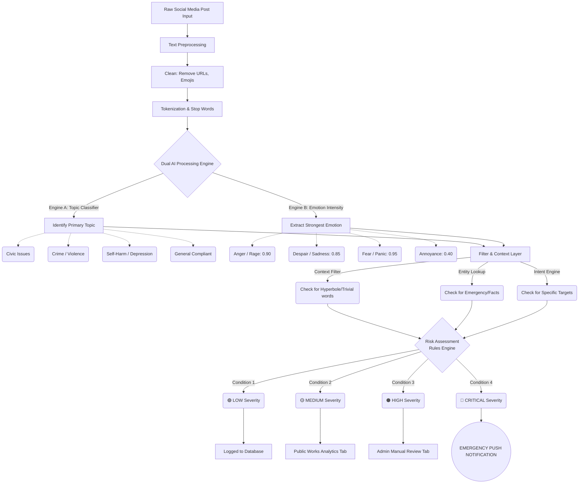

# AI-Based Social Issue Detection: System Architecture & Logic Flow

This document details the exact architectural flow and logic engine of the AI-Based Social Issue Detection system. It traces the lifecycle of a social media post from initial ingestion to final dashboard visualization, explaining how the platform uses Natural Language Processing (NLP) to determine category, emotion intensity, and overall severity.

> [!CAUTION]
> **Important Note for Project Presentation:** This architecture incorporates advanced edge-case handling (intent detection, hyperbole filtering, and emergency overriding) to solve common NLP loopholes.

---

## 1. Complete System Flow Diagram

The following Mermaid flowchart visualizes the entire classification engine. You can use this diagram in your project reports.

---

## Phase 1: Data Ingestion & Preprocessing
Before the AI attempts to understand the post, it must normalize the data.

1. **Input Generation:** The system ingests a raw string of text. *(e.g., "Omg there is a massive crash on the highway rn!! 😭 cars are on fire")*
2. **Data Cleaning:** Removes non-essential noise like emojis (`😭`), punctuation, and random capitalization.
3. **Tokenization:** Splits the cleaned text into core semantic tokens: `["massive", "crash", "highway", "cars", "fire"]`

---

## Phase 2: The Dual-Engine Assessment
To understand the nuance of human language, the post passes through two distinct analysis models simultaneously.

### Engine A: Topic Categorization (The "What")
This engine determines the factual **subject matter** of the post using Keyword Matching and Topic Modeling.
* **Threat Categories:** Violence, Harassment, Self-Harm, Emergency/Disaster, Crime.
* **Civic Categories:** Potholes, Utilities, Traffic, Public Nuisance.

### Engine B: Emotion Intensity Scoring (The "How")
This engine bypasses the topic entirely and analyzes the **psychological state** of the user. Using advanced NLP Sentiment libraries (like RoBERTa or VADER), it returns a specific emotion and a probability score between `0.0` and `1.0`.
* **High-Risk Emotions:** Despair (`0.95`), Fear/Panic (`0.90`), Extreme Anger (`0.85`).
* **Low-Risk Emotions:** Annoyance (`0.45`), Sadness (`0.30`).

---

## Phase 3: The Filter Layer (Handling AI Loopholes)
This is the "intelligence" layer. AI is prone to making mistakes by reading things out of context. The Filter Layer runs three checks to ensure the severity is accurate:

> [!NOTE]
> **The Hyperbole Check (Fixing False Positives)**
> Detects exaggerated venting. If the system detects intense anger combined with a violent word (e.g., "kill"), it scans for trivial context words like `"wifi"`, `"game"`, or `"boss"`. If present, the threat is downgraded to an exaggerated complaint.

> [!TIP]
> **The Emergency Entity Check (Fixing False Negatives)**
> Detects "deadpan" emergency reports. If a user posts about a `"car crash"` or `"shooter"` in a calm, factual tone (Low Emotion Intensity), the system extracts the physical entity (the crash) and bypasses the emotion calculation, forcing an Emergency Alert.

> [!WARNING]
> **The Target Check (Intent Analysis)**
> Detects whether a threat is aimed at a specific person or location. It looks for pronouns (`"him"`, `"her"`) or Named Entities (`"City High School"`). Threats with a specific target and location are scored higher than vague overarching complaints.

---

## Phase 4: Final Severity & Risk Engine
The Rules Engine aggregates the data from Phases 2 and 3 into an actionable severity matrix.

| Severity Level | Required Conditions | Real-World Example | System Action |
| :--- | :--- | :--- | :--- |
| **🟢 LOW** | Safe Topic + Low/Medium Emotion | *"The internet here is so slow today."* | Quietly deposited into the database for future trend analysis. |
| **🟡 MEDIUM** | Civic Topic + High Emotion **OR** Threat Topic + Hyperbole Filter | *"This pothole has been here for 3 weeks and I'm furious!"* | Highlighted on the Analytics Dashboard for city planners or relevant departments. |
| **🟠 HIGH** | Threat Topic + High Emotion, but lacks specific location / intent. | *"I hate everything, I just want to kill them all."* (Ambiguous) | Sent to a specialized Admin Dashboard for **Manual Human Review**. High priority, but not an immediate 911 call. |
| **🔴 CRITICAL** | Threat/Emergency Topic + High Emotion + Specific Location **OR** Emergency Entity Bypass | *"I'm on the 5th street bridge and I'm going to end it all right now."* | High-priority **Red Alert** push notification. Immediate intervention required by authorities. |
